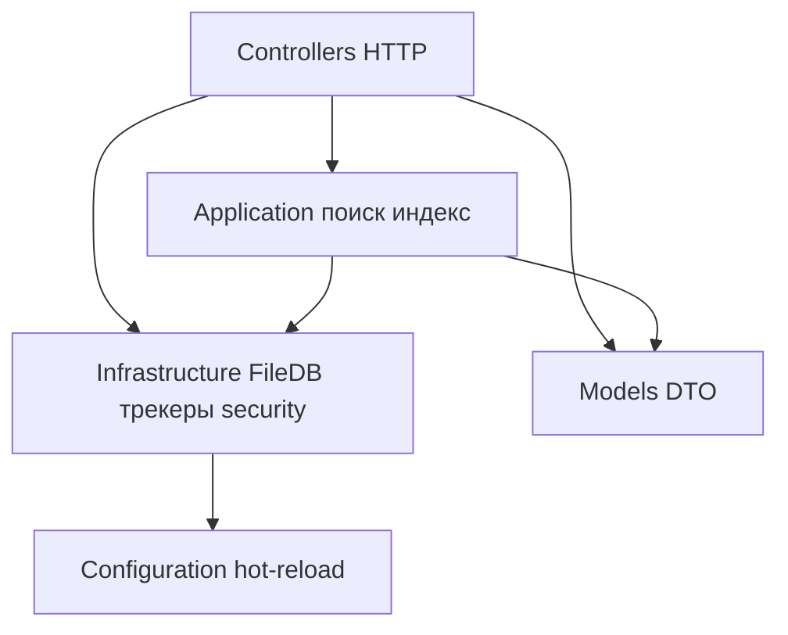
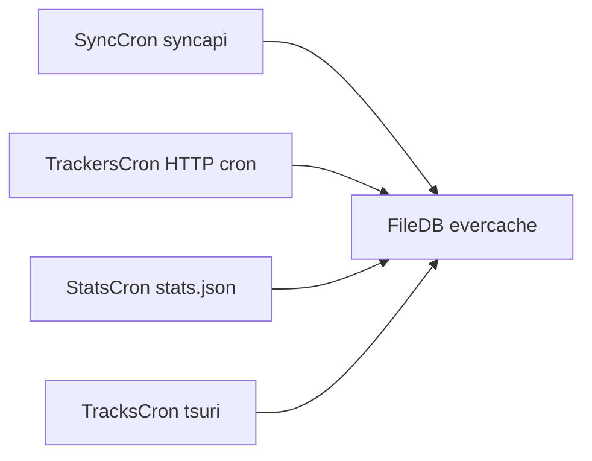

# Архитектура

JacRed — **ASP.NET Core 10** (single project `JacRed.csproj`).

## Слои проекта

| Компонент | Путь | Назначение |
| --- | --- | --- |
| **Security** | `Infrastructure/Security/` | `JacRedEndpointRegistry`, `JacRedAuthorizationMiddleware`, `UseJacRedSecurity()` |
| **Logging** | `Infrastructure/Logging/` | `JacRedLog`, console categories, M.E.Logging |
| **FileDB** | `Infrastructure/Persistence/FileDB/` | Файловая БД, `masterDb`, cron fdb |
| **Search** | `Infrastructure/Indexers/`, `Application/Search/` | Jackett / Torznab / v1 torrents |
| **Trackers** | `Infrastructure/Trackers/{Name}/` | Parser + SyncService на трекер |
| **Background** | `Infrastructure/Background/` | `SyncWorker`, `StatsWorker`, `TrackersWorker`, `FileDbWorker`, `TracksWorker`, `FastDbRefreshWorker` |
| **Config** | `Configuration/AppConfigurationProvider.cs` | Загрузка, hot-reload, redaction |

## Фоновые процессы

- **SyncCron** — pull с `syncapi` (`/sync/fdb/torrents`)
- **TrackersCron** — парсинг по HTTP `/cron/*` (внешний cron) + внутренние циклы
- **StatsCron** — `stats.json`, `tracks-stats.json`
- **TracksCron** — ffprobe через `tsuri` (если `tracks: true`)
- **FileDB cron** — evercache, ffprobe refresh
